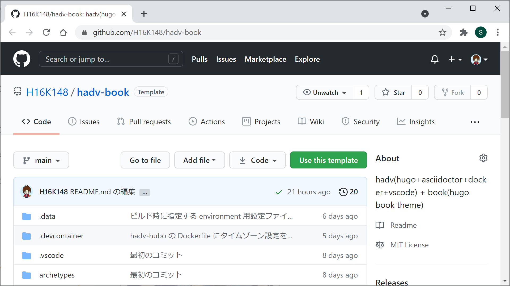
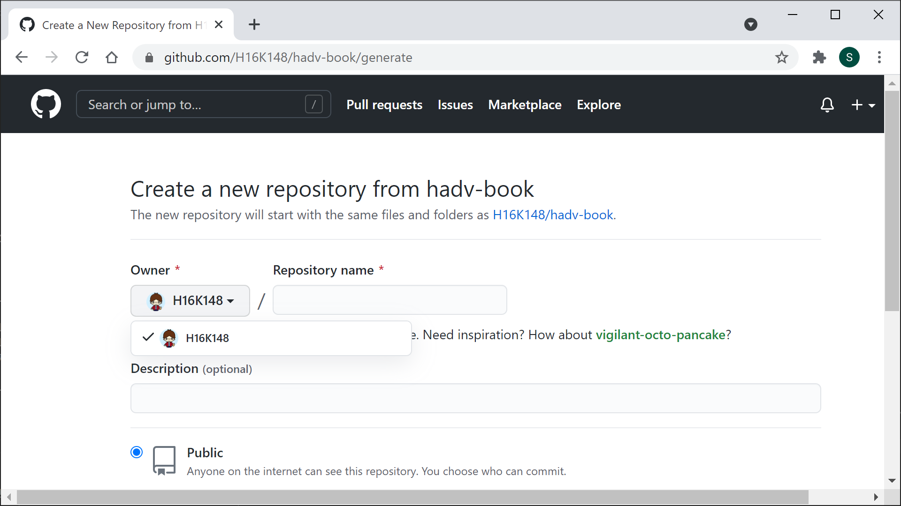
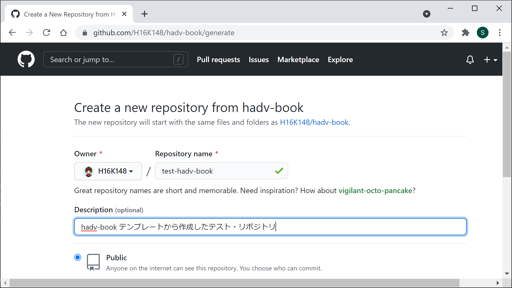
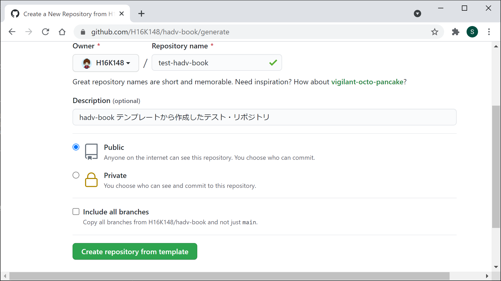
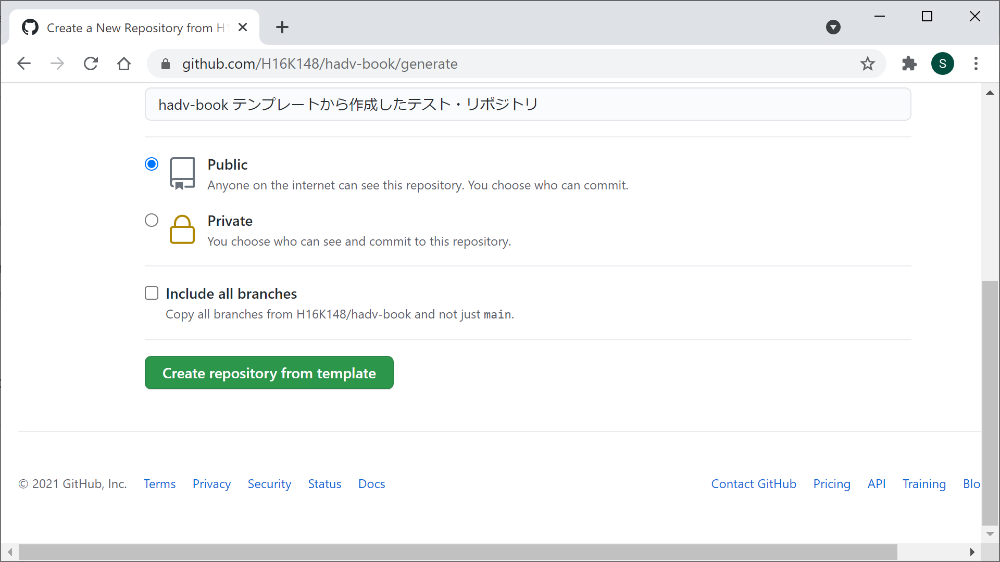
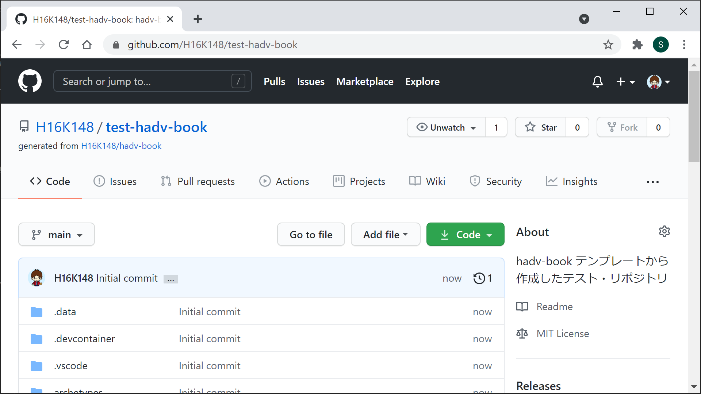

---
###### Hugo Predefined
###### https://gohugo.io/content-management/front-matter/
#aliases:       # Set on each page
#audio:         # Set on each page
date: 2021-04-24T18:29:11+09:00
description: "hadv-book テンプレートを使って新規リポジトリを作成する参考情報"
#draft: true
#expiryDate:    # Set on each page 
#headless:      # Set on each page
#images:        # Set on each page
isCJKLanguage: true
keywords:
  - hadv
#layout:        # Set on each page
#lastmod:       # Set on each page
#linkTitle:     # Set on each page
#markup:        # Set on each page
#outputs:       # Set on each page
#publishDate:   # Set on each page
#resources:     # Set on each page
#series:        # Set on each page
#slug:          # Set on each page
summary: "hadv-book テンプレートを使って新規リポジトリを作成する手順など"
title: "4. リポジトリの作成"
type: 'docs'
#url:           # Set on each page
#videos:        # Set on each page
weight: 4
## <taxonomies>
categories: ["環境構築"]
tags: ["Github"]
###### Hugo Book Theme Defined
###### https://themes.gohugo.io/hugo-book/
## See /content/docs/_index.md
## (Optional) Set to 'true' to mark page as flat section in file-tree menu (if BookMenuBundle not set)
#bookFlatSection: false
## (Optional) Set to hide nested sections or pages at that level. Works only with file-tree menu mode
#bookCollapseSection: false
## (Optional) Set true to hide page or section from side menu (if BookMenuBundle not set)
#bookHidden: false
## (Optional) Set 'false' to hide ToC from page
#bookToC: true
## (Optional) If you have enabled BookComments for the site, you can disable it for specific pages.
#bookComments: false
## (Optional) Set to 'false' to exclude page from search index.
#bookSearchExclude: true
---

# 4. リポジトリの作成

ここは 004-create-repo（content/docs/usage/getting-started/004-create-repo）です。

## はじめに

テンプレートからリポジトリを作成することはリポジトリをフォークすることに似ているが、以下の違いがあるとのこと。

- 新しいフォークは、親リポジトリのコミット履歴すべてを含んでいますが、テンプレートから作成されたリポジトリには、最初は 1 つのコミットしかありません。
- フォークへのコミットはコントリビューショングラフに表示されませんが、テンプレートから作成されたリポジトリへのコミットはコントリビューショングラフに表示されます。
- フォークは、既存のプロジェクトにコードをコントリビュートするための一時的な方法となります。テンプレートからリポジトリを作成することは、新しいプロジェクトを素早く始める方法です。

hadv-book をフォークして使うこともできますが、ここでは、テンプレートとなっている [https://github.com/H16K148/hadv-book](https://github.com/H16K148/hadv-book) リポジトリを使って、
Github 上に新しいリポジトリを作成する方法を紹介します。


テンプレートからリポジトリを作成する手順については、  
[https://docs.github.com/ja/github/creating-cloning-and-archiving-repositories/creating-a-repository-from-a-template](https://docs.github.com/ja/github/creating-cloning-and-archiving-repositories/creating-a-repository-from-a-template)  
に情報があります。


## 01. リポジトリを作成する

### メインページにアクセス

リポジトリのメインページ（[https://github.com/H16K148/hadv-book](https://github.com/H16K148/hadv-book)）にアクセスします。

### Use this template をクリック 

緑色のボタン「Use this template」をクリックします。

### アカウントの選択

Owner（オーナー）ドロップダウンメニューを使い、リポジトリを所有したいアカウントを選択してください。

### リポジトリ名の入力

リポジトリの名前と、任意で説明を入力してください。

### リポジトリ可視性の選択など

リポジトリの可視性を選択してください。  
hadv-book のように、hugo コマンドの実行で作成された Web サイト を Github Pages で公開するなら「Public」を選びます。  
hadv-book にブランチはありませんので、「Include all branches」にチェックは必要ありません。

### リポジトリを作成

緑色のボタン「Create repository from template」をクリックします。

新しくリポジトリが作成されました。

