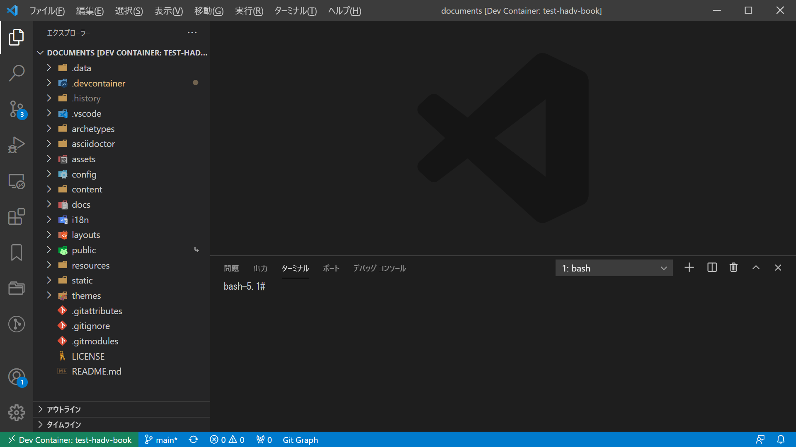

---
###### Hugo Predefined
###### https://gohugo.io/content-management/front-matter/
#aliases:       # Set on each page
#audio:         # Set on each page
date: 2021-04-25T00:40:06+09:00
description: "hadv-book テンプレートを使って作成した新規リポジトリの編集についての参考情報"
#draft: true
#expiryDate:    # Set on each page 
#headless:      # Set on each page
#images:        # Set on each page
isCJKLanguage: true
keywords:
  - hadv
#layout:        # Set on each page
#lastmod:       # Set on each page
#linkTitle:     # Set on each page
#markup:        # Set on each page
#outputs:       # Set on each page
#publishDate:   # Set on each page
#resources:     # Set on each page
#series:        # Set on each page
#slug:          # Set on each page
summary: "hadv-book テンプレートを使って作成した新規リポジトリの編集手順など"
title: "5. リポジトリの編集"
type: 'docs'
#url:           # Set on each page
#videos:        # Set on each page
weight: 5
## <taxonomies>
categories: ["環境構築"]
tags: ["DevContainer","Hugo"]
###### Hugo Book Theme Defined
###### https://themes.gohugo.io/hugo-book/
## See /content/docs/_index.md
## (Optional) Set to 'true' to mark page as flat section in file-tree menu (if BookMenuBundle not set)
#bookFlatSection: false
## (Optional) Set to hide nested sections or pages at that level. Works only with file-tree menu mode
#bookCollapseSection: false
## (Optional) Set true to hide page or section from side menu (if BookMenuBundle not set)
#bookHidden: false
## (Optional) Set 'false' to hide ToC from page
#bookToC: true
## (Optional) If you have enabled BookComments for the site, you can disable it for specific pages.
#bookComments: false
## (Optional) Set to 'false' to exclude page from search index.
#bookSearchExclude: true
---

# 5. リポジトリの編集

ここは 005-edit-repo（content/docs/usage/getting-started/005-edit-repo）です。

## はじめに

テンプレートから新たに作成したリポジトリ（ここでは [test-hadv-book](https://github.com/H16K148/test-hadv-book) リポジトリとします）の作成直後のデータは、
hadv-book の [Web ページ](https://h16k148.github.io/hadv-book/)をビルドするための設定のままとなっているため、
いくつかの設定変更が必要になります。  
また、Github Pages の設定も解除されているため、ビルドした Web サイトを公開するためには改めて公開する設定に変更する必要があります。

## 01. リポジトリを複製

Windows 上の任意のフォルダー（ここでは仮に、C:\\\\path\\to\\dir\\test-hadv-book を指定）に、リポジトリを複製します。  
Ubuntu-20.04 コンソール画面にて、以下を実行します。

```bash {linenos=table,linenostart=1}
git clone --recursive https://github.com/H16K148/test-hadv-book.git \
/mnt/c/path/to/dir/test-hadv-book
```

ここで作成されたフォルダー（test-hadv-book）を『ローカル作業ディレクトリ』と呼ぶことにします。

## 02. VSCode でフォルダーを開く

VSCode でフォルダーを開く方法は複数あります。

- VSCode を起動して「ファイル > フォルダーを開く」で開きたいディレクトリを選択する。
- エクスプローラーで開きたいディレクトリを右クリックしてメニューを開き、「Code で開く」を選択する。  
（インストーラーによるインストール時に追加タスクとして「Code で開く」アクションを追加した場合のみ）
- コマンドプロンプトで開きたいディレクトリに移動して『**code .**』を実行する。  
（パスが通っている場合のみ）

上記いずれかの方法を用いて、『ローカル作業ディレクトリ』を VSCode で開きます。

## 03. devcontainer の設定変更
### .devcontainer/.env

次の設定を変更します。
- HADV_NAME_PREFIX
  - 使用するコンテナ名のプレフィックスを指定。別の hadv プロジェクトと被ってはいけません。
- HADV_URL_SUBDIRECTORY
  - ビルドした Web サイトのルートとなるサブディレクトリを指定。Github Pages で公開する場合など、他と被らないように注意が必要。
- HADV_STAGING_PORT
  - hadv のステージングサイトに使用するポート番号を指定。別の hadv プロジェクトと被ってはいけません。

#### 変更前
```bash {linenos=table,linenostart=1}
HADV_NAME_PREFIX=hadv-book
HADV_URL_SUBDIRECTORY=hadv-book/
HADV_STAGING_PORT=8082
```

#### 変更後
```bash {linenos=table,linenostart=1}
HADV_NAME_PREFIX=test-hadv-book
HADV_URL_SUBDIRECTORY=test-hadv-book/
HADV_STAGING_PORT=8083
```

## 04. devcontainer を起動

Ctrl+Shift+P または F1 で表示される入力域を使って「Remote-Containers: Reopen Folder in Container」を実行する。



Dev Container が立ち上がります。

## 05. hugo の設定変更

ファイルから「変更前」の行を探し出し、「変更後」の状態に書き換えます。


URL のサブディレクトリに当たる部分の設定値は、.devcontainer/.env の [HADV_URL_SUBDIRECTORY](./#devcontainerenv) と合わせなければいけません。
設定値がズレていると、ステージングサイトが正しく表示されないことがあります。  
（スラッシュ『/』の置き方に注意してください）


### config/_default/config.toml
#### 変更前
```bash
baseURL = "https://localhost/hadv-book/"
title = "hadv-book"
  BookRepo = 'https://github.com/H16K148/hadv-book'
  CopyrightHTML = "Copyright &#xA9; 2021 <a href=\"https://h16k148.github.io\">H16K148</a>. All Rights Reserved."
```

#### 変更後
```bash
baseURL = "https://localhost/test-hadv-book/"
title = "test-hadv-book"
  BookRepo = 'https://github.com/H16K148/test-hadv-book'
  CopyrightHTML = "Copyright &#xA9; 2021 <a href=\"https://h16k148.github.io\">H16K148</a>. All Rights Reserved."
```
ここでは CopyrightHTML を書き換えていませんが、書き換えてください。フッター固定の表示内容が変わります。

### config/production/config.toml
#### 変更前
```bash
baseURL = "https://h16k148.github.io/hadv-book/"
```

#### 変更後
```bash
baseURL = "https://h16k148.github.io/test-hadv-book/"
```

### config/staging/config.toml
#### 変更前
```bash
baseURL = "/hadv-book/"
```

#### 変更後
```bash
baseURL = "/test-hadv-book/"
```

### assets/_variables.scss
#### 変更前
```SCSS {linenos=table,linenostart=1}
/* You can override SASS variables here. */

$container-max-width: 96rem;
$menu-width: 18rem;
$toc-width: 18rem;
$fa-font-path: "/hadv-book/webfonts";

// @import "plugins/dark";
```

#### 変更後
```SCSS {linenos=table,linenostart=1}
/* You can override SASS variables here. */

$container-max-width: 96rem;
$menu-width: 18rem;
$toc-width: 18rem;
$fa-font-path: "/test-hadv-book/webfonts";

// @import "plugins/dark";
```
fontawesome の webfont パスの設定値「$fa-font-path」を修正します。
