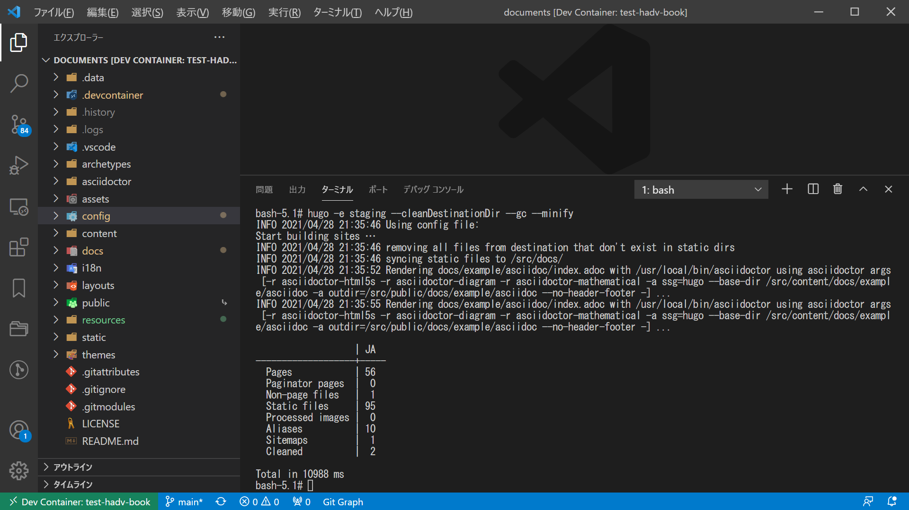
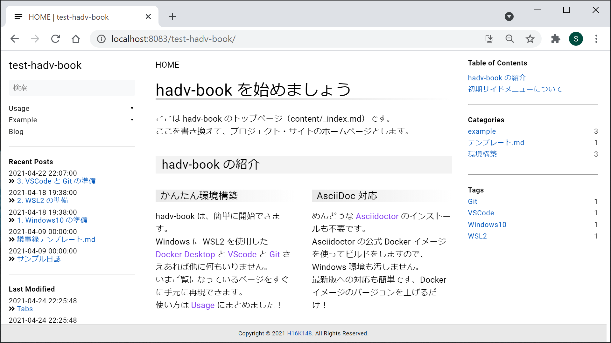

---
###### Hugo Predefined
###### https://gohugo.io/content-management/front-matter/
#aliases:       # Set on each page
#audio:         # Set on each page
date: 2021-04-28T21:40:01+09:00
description: "hadv-book テンプレートを使って作成した新規リポジトリの Web サイトをビルドする参考情報"
#draft: true
#expiryDate:    # Set on each page 
#headless:      # Set on each page
#images:        # Set on each page
isCJKLanguage: true
keywords:
  - hadv
#layout:        # Set on each page
#lastmod:       # Set on each page
#linkTitle:     # Set on each page
#markup:        # Set on each page
#outputs:       # Set on each page
#publishDate:   # Set on each page
#resources:     # Set on each page
#series:        # Set on each page
#slug:          # Set on each page
summary: "hadv-book テンプレートを使って作成した新規リポジトリの Web サイトをビルドする手順など"
title: "6. Web サイトのビルド"
type: 'docs'
#url:           # Set on each page
#videos:        # Set on each page
weight: 6
## <taxonomies>
categories: ["環境構築"]
tags: ["Hugo"]
###### Hugo Book Theme Defined
###### https://themes.gohugo.io/hugo-book/
## See /content/docs/_index.md
## (Optional) Set to 'true' to mark page as flat section in file-tree menu (if BookMenuBundle not set)
#bookFlatSection: false
## (Optional) Set to hide nested sections or pages at that level. Works only with file-tree menu mode
#bookCollapseSection: false
## (Optional) Set true to hide page or section from side menu (if BookMenuBundle not set)
#bookHidden: false
## (Optional) Set 'false' to hide ToC from page
#bookToC: true
## (Optional) If you have enabled BookComments for the site, you can disable it for specific pages.
#bookComments: false
## (Optional) Set to 'false' to exclude page from search index.
#bookSearchExclude: true
---

# 6. Web サイトのビルド

ここは 006-build-website（content/docs/usage/getting-started/006-build-website）です。

## はじめに

これまでの手順で、test-hadv-book の Web サイトをビルドする準備が整いました。  
ここでは、hugo コマンドでビルドし、ステージングサイトで Web サイトを確認するところまで行います。

## 01. hugo コマンドでビルド

ステージングサイトのビルドを行います。  
初回のビルドは、hadv-book だった時のキャッシュ等も残っているため、いくつかビルドオプションを付与することをおススメします。


```bash
bash-5.1# hugo --help
hugo is the main command, used to build your Hugo site.

Hugo is a Fast and Flexible Static Site Generator
built with love by spf13 and friends in Go.

Complete documentation is available at http://gohugo.io/.

Usage:
  hugo [flags]
  hugo [command]

Available Commands:
  config      Print the site configuration
  convert     Convert your content to different formats
  deploy      Deploy your site to a Cloud provider.
  env         Print Hugo version and environment info
  gen         A collection of several useful generators.
  help        Help about any command
  import      Import your site from others.
  list        Listing out various types of content
  mod         Various Hugo Modules helpers.
  new         Create new content for your site
  server      A high performance webserver
  version     Print the version number of Hugo

Flags:
  -b, --baseURL string             hostname (and path) to the root, e.g. http://spf13.com/
  -D, --buildDrafts                include content marked as draft
  -E, --buildExpired               include expired content
  -F, --buildFuture                include content with publishdate in the future
      --cacheDir string            filesystem path to cache directory. Defaults: $TMPDIR/hugo_cache/
      --cleanDestinationDir        remove files from destination not found in static directories
      --config string              config file (default is path/config.yaml|json|toml)
      --configDir string           config dir (default "config")
  -c, --contentDir string          filesystem path to content directory
      --debug                      debug output
  -d, --destination string         filesystem path to write files to
      --disableKinds strings       disable different kind of pages (home, RSS etc.)
      --enableGitInfo              add Git revision, date and author info to the pages
  -e, --environment string         build environment
      --forceSyncStatic            copy all files when static is changed.
      --gc                         enable to run some cleanup tasks (remove unused cache files) after the build
  -h, --help                       help for hugo
      --i18n-warnings              print missing translations
      --ignoreCache                ignores the cache directory
      --ignoreVendor               ignores any _vendor directory
      --ignoreVendorPaths string   ignores any _vendor for module paths matching the given Glob pattern
  -l, --layoutDir string           filesystem path to layout directory
      --log                        enable Logging
      --logFile string             log File path (if set, logging enabled automatically)
      --minify                     minify any supported output format (HTML, XML etc.)
      --noChmod                    don't sync permission mode of files
      --noTimes                    don't sync modification time of files
      --path-warnings              print warnings on duplicate target paths etc.
      --print-mem                  print memory usage to screen at intervals
      --quiet                      build in quiet mode
      --renderToMemory             render to memory (only useful for benchmark testing)
  -s, --source string              filesystem path to read files relative from
      --templateMetrics            display metrics about template executions
      --templateMetricsHints       calculate some improvement hints when combined with --templateMetrics
  -t, --theme strings              themes to use (located in /themes/THEMENAME/)
      --themesDir string           filesystem path to themes directory
      --trace file                 write trace to file (not useful in general)
  -v, --verbose                    verbose output
      --verboseLog                 verbose logging
  -w, --watch                      watch filesystem for changes and recreate as needed

Additional help topics:
  hugo check   Contains some verification checks

Use "hugo [command] --help" for more information about a command.
```


```bash {linenos=table,linenostart=1}
hugo -e staging --cleanDestinationDir --gc --minify
```
build environment に「staging」をセットすることにより、config/_default/config.toml の設定を config/staging/config.toml の設定で上書きします。
その他のオプションは正しい意味で「適当」に付けます。
例では、static ディレクトリにないファイルを削除したり、minify を有効にして、使用していないキャッシュをビルド後に削除したりしています

VSCode のターミナルにて、上記コマンドを実行します。



## 02. ビルドした Web サイトの確認

ステージングサイトの URL にアクセスします。  
URL は以下のひな形に設定値を当てはめたものになります。

```text
http://localhost:<ポート番号>/<サブディレクトリ>
```

- ポート番号
  - [.devcontainer/.env](#devcontainerenv) の HADV_STAGING_PORT
- サブディレクトリ
  - [.devcontainer/.env](#devcontainerenv) の HADV_URL_SUBDIRECTORY

そのため、これまで作成してきた test-hadv-book の場合は、
```text
http://localhost:8083/test-hadv-book
```
にアクセスすることになります。


