---
###### Hugo Predefined
###### https://gohugo.io/content-management/front-matter/
#aliases:       # Set on each page
#audio:         # Set on each page
date: 2021-04-28T22:34:46+09:00
description: "hadv-book テンプレートを使って作成した新規リポジトリの Web サイトを Github Pages で公開する参考情報"
#draft: true
#expiryDate:    # Set on each page 
#headless:      # Set on each page
#images:        # Set on each page
isCJKLanguage: true
keywords:
  - hadv
#layout:        # Set on each page
#lastmod:       # Set on each page
#linkTitle:     # Set on each page
#markup:        # Set on each page
#outputs:       # Set on each page
#publishDate:   # Set on each page
#resources:     # Set on each page
#series:        # Set on each page
#slug:          # Set on each page
summary: "hadv-book テンプレートを使って作成した新規リポジトリの Web サイトを Github Pages で公開する手順など"
title: "7. Github Pages で公開"
type: 'docs'
#url:           # Set on each page
#videos:        # Set on each page
weight: 7
## <taxonomies>
categories: ["環境構築"]
tags: ["Git","Github"]
###### Hugo Book Theme Defined
###### https://themes.gohugo.io/hugo-book/
## See /content/docs/_index.md
## (Optional) Set to 'true' to mark page as flat section in file-tree menu (if BookMenuBundle not set)
#bookFlatSection: false
## (Optional) Set to hide nested sections or pages at that level. Works only with file-tree menu mode
#bookCollapseSection: false
## (Optional) Set true to hide page or section from side menu (if BookMenuBundle not set)
#bookHidden: false
## (Optional) Set 'false' to hide ToC from page
#bookToC: true
## (Optional) If you have enabled BookComments for the site, you can disable it for specific pages.
#bookComments: false
## (Optional) Set to 'false' to exclude page from search index.
#bookSearchExclude: true
---

# 7. Github Pages で公開

ここは 007-github-pages（content/docs/usage/getting-started/007-github-pages）です。

## はじめに

ここでは、
「[5. リポジトリの編集]()」で設定し直した内容、
「[6. Web サイトのビルド]()」でビルドした最新の
Web サイトをローカルリポジトリにコミットし、さらにリモートリポジトリ（Github）にプッシュ、そして、
Github リポジトリの Github Pages 公開設定を変更して、ビルドした Web サイトを公開するところまで紹介します。

## 01. ローカルリポジトリにコミット
### git add

これまで変更した内容すべてをコミットの対象とするように、ファイルを Git のステージングエリアに追加します。

VSCode のターミナルにて次のコマンドを実行します。
```bash {linenos=table,linenostart=1}
git add --all
```
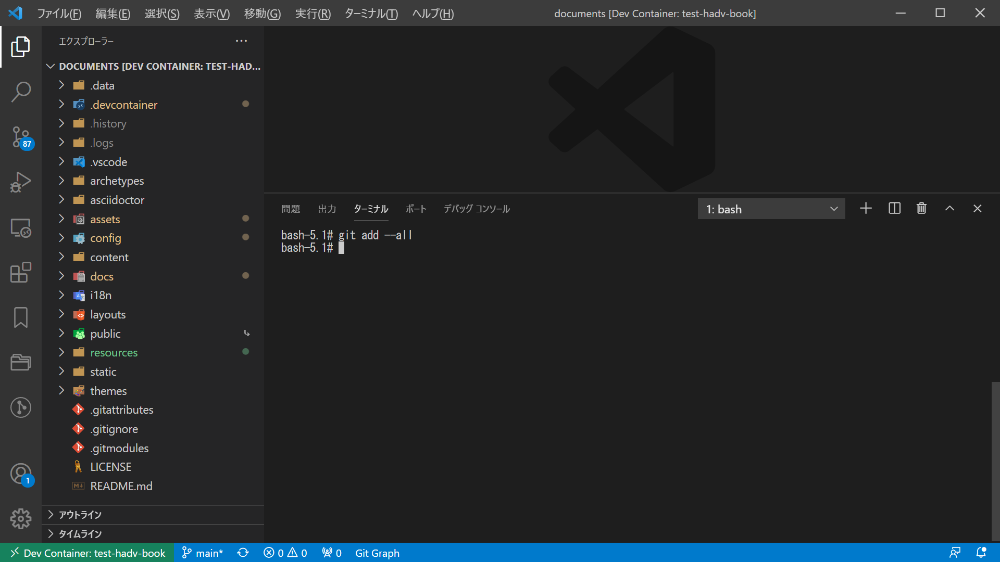

### git config

コミットを行う前に、プロジェクトの Git 設定を行います。  
VSCode ターミナルで実行する git コマンドは Dev Container で作成されたコンテナ内のものを使用するため、新たに設定を行う必要があります。

設定しないでコミットを行うと
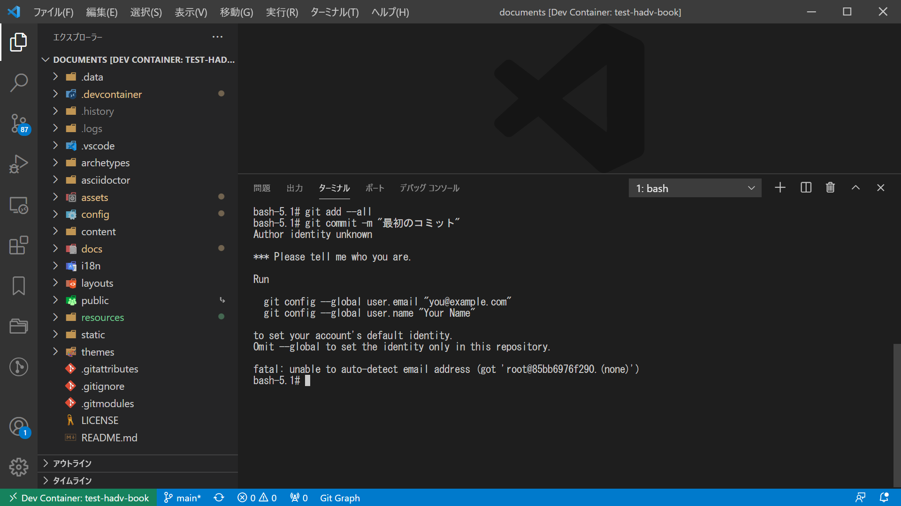
「Author identity unknown」が表示されます。

個人の識別情報を設定するには、
```bash {linenos=table,linenostart=1}
git config user.name "H16K148"
git config user.email "h16k148@gmail.com"
```
このように実行します。  


個人の識別情報の設定時に --global を付けないのは理由があります。  
hugo や asciidoctor のバージョンを更新する時など、Dev Container で使っているコンテナを再作成することがありますが、
その時、--global で設定した個人の識別情報なども消えてしまうのです。


### git commit

Git のステージングエリアにあるファイルをコミットします。

```bash {linenos=table,linenostart=1}
git commit -m "最初のコミット"
```
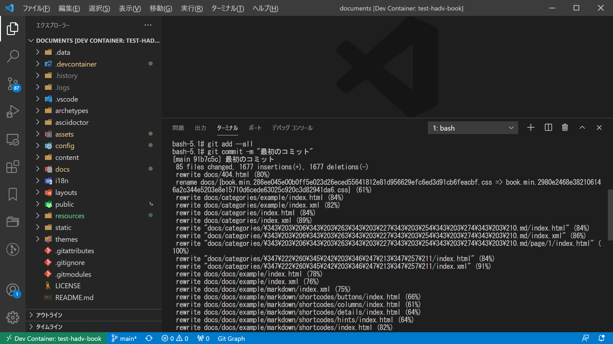

## 02. リモートリポジトリにプッシュ
### git push

リモートリポジトリに変更内容をプッシュします。
```bash {linenos=table,linenostart=1}
git push
```



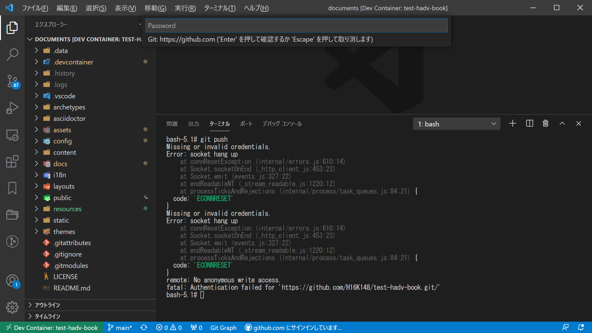

VSCode に Github のトークンキーを入力する必要があります。

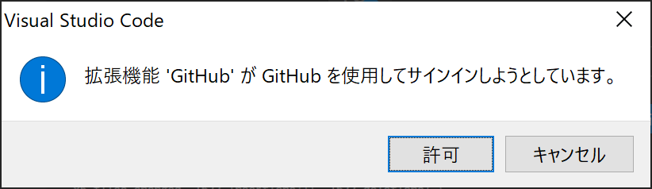

という表示が出ている場合、「許可」を押すとブラウザが立ち上がり、


と表示されます。  
続けて「Continue」ボタンを押すと、トークンキーが得られます。

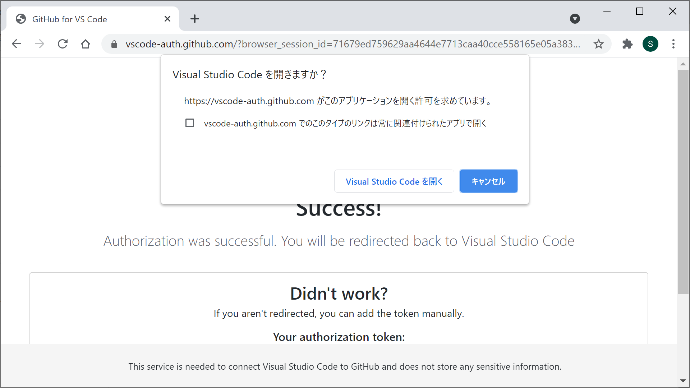

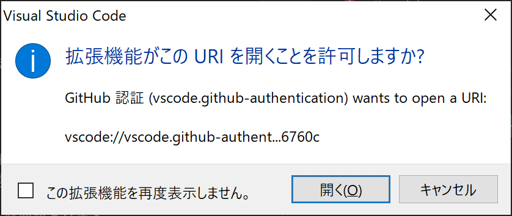

このへんの表示には適当に「開く」で対応。  

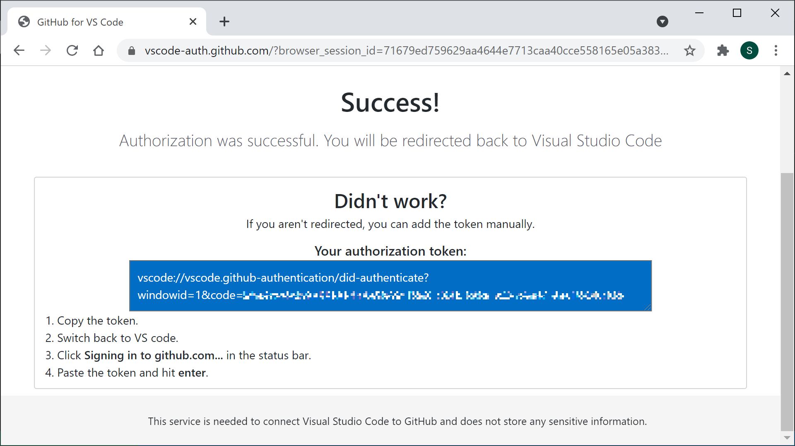

トークンキーを VSCode に入力します。



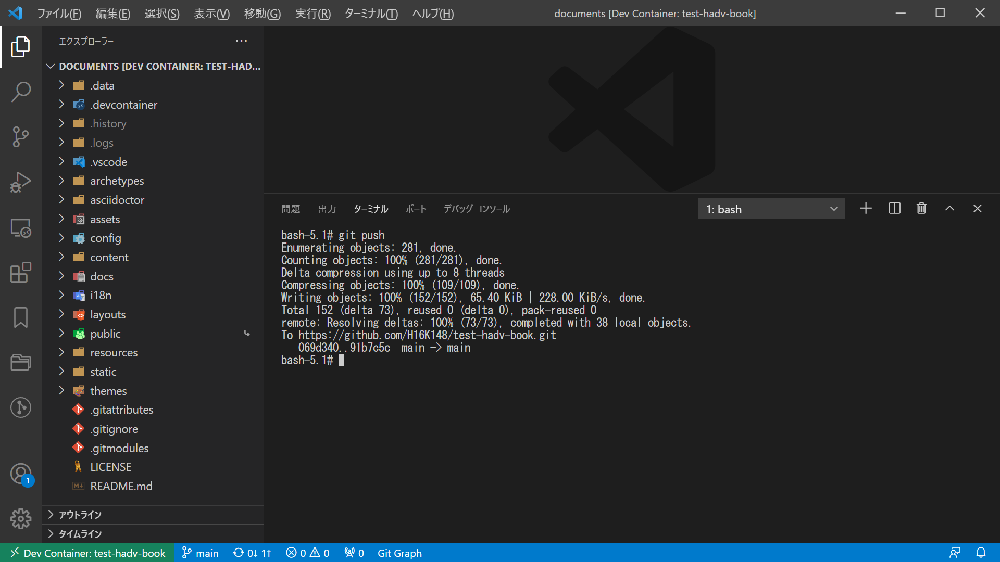

## 03. Github リポジトリ設定変更

リポジトリにアクセスし、

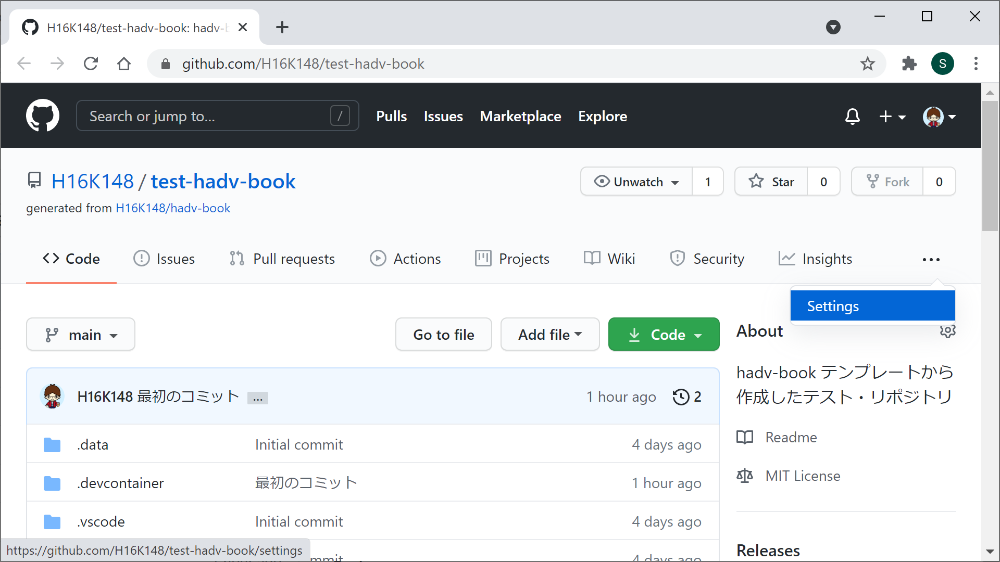

Settings 画面を表示、

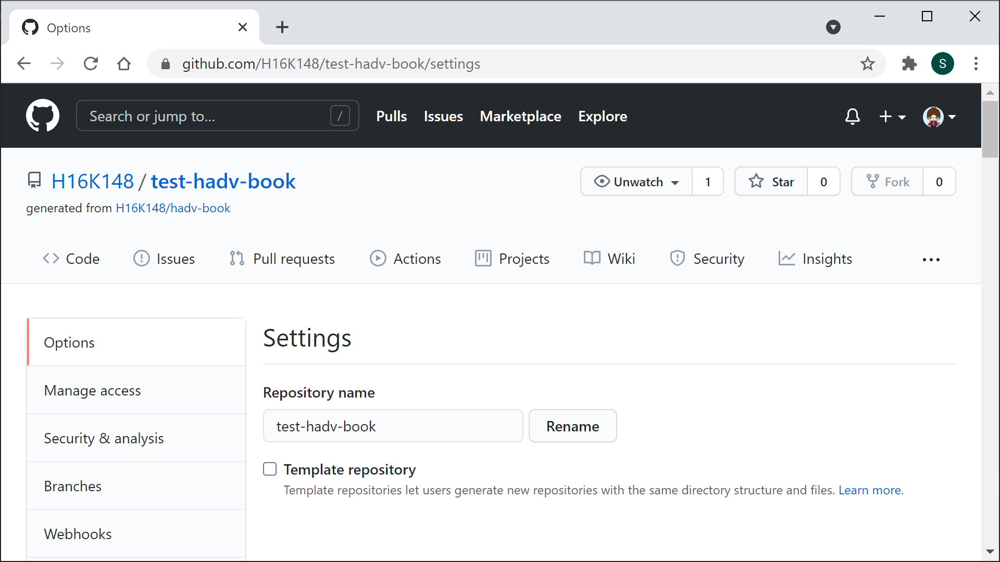

左サイドの Options にある Pages リンクをクリックします。

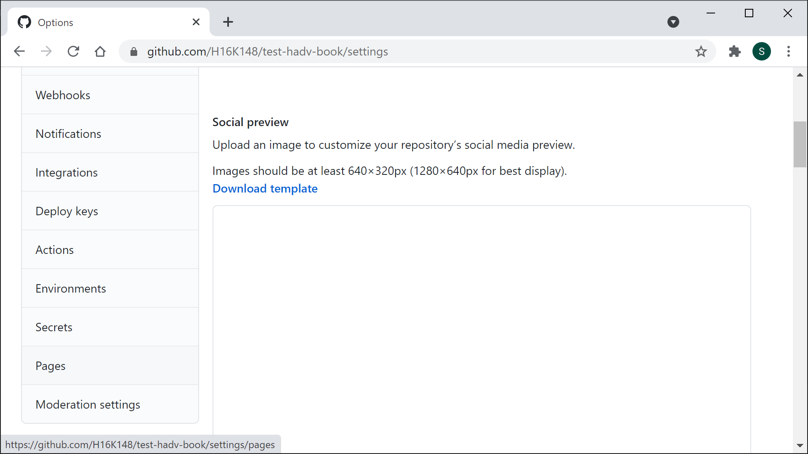

遷移先の Github Pages 設定画面で、

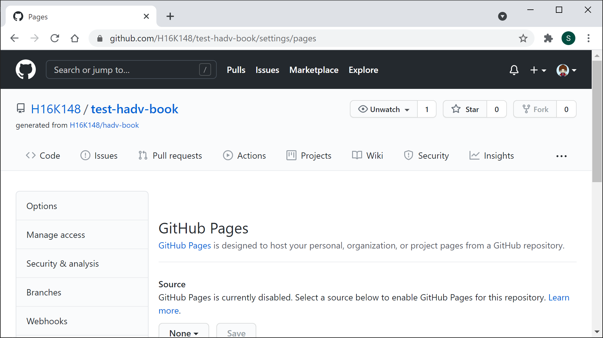

Web サイトとして公開する Branch と ディレクトリを選択して「Save」を押します。

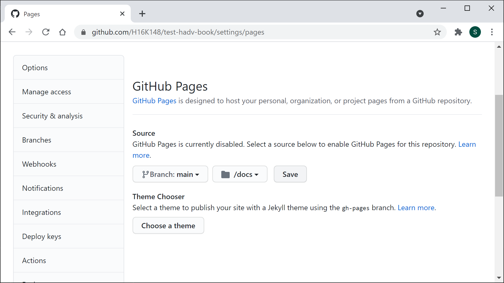

設定が保存され、test-hadv-book の Web サイトが公開されます。

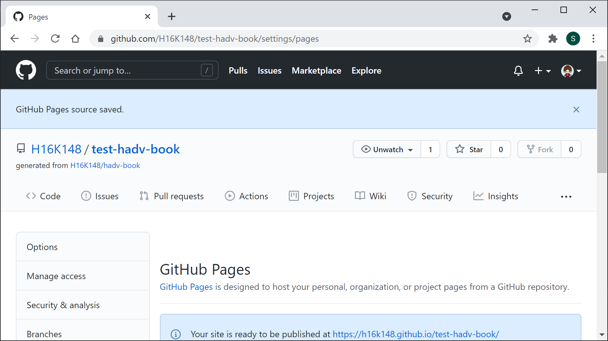

## 04. Web サイトへのアクセス

公開された test-hadv-book の Web サイトにアクセスします。

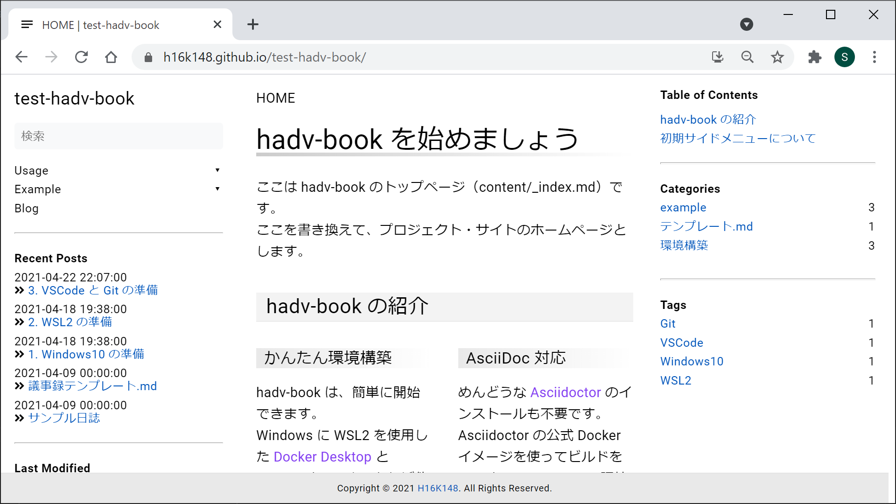
